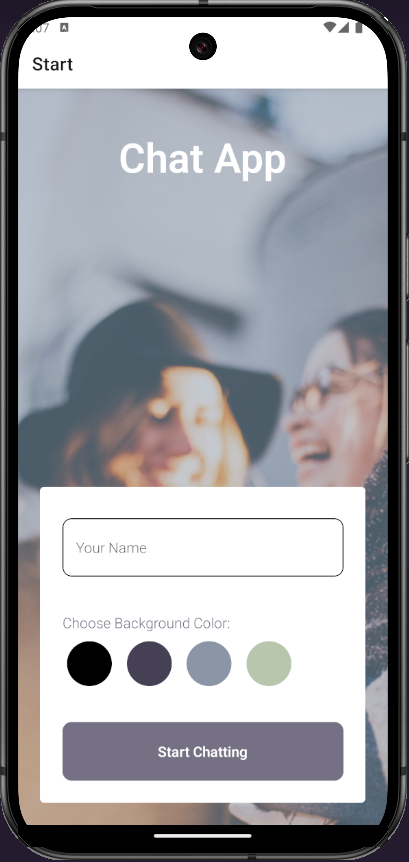
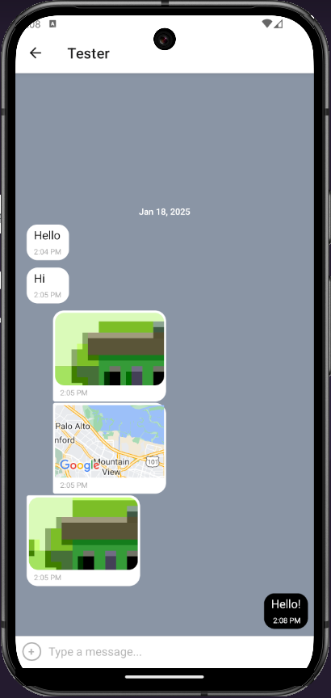

# Chat App

The Chat App is a mobile application built using React Native. This app provides users with a chat interface and options to share images and their location.

  

## Features

- Users can enter their name and choose a background color for the chat screen before joining the chat.
- Users can view the conversation, as well as an input field and submit button.
- Provides users with two additional communication features: sending images and location data.
- Data is stored both online and offline.

## Technology Used

- React Native
- Expo
- Android Studio
- Firestore/Firebase
- Gifted Chat
- Async Storage

## Setup

- Clone the [repository](https://github.com/raschkatie/chat-app)

```
git clone https://github.com/raschkatie/chat-app.git
cd chat-app
```

- Install dependencies

```
npm install
```

- Install Expo CLI

```
npm install -g expo-cli
```

- Configure Firebase
  - Go to Firebase Console
  - Create a new project
  - Add a web app
  - In the Rules tab within Firebase, change `false` to `true` in line 5
  ```
  service cloud.firestore {
    match /databases/{database}/documents {
      match /{document=**} {
        allow read, write: if true;
      }
    }
  }
  ```
  - Copy and Paste your Firebase credentials in the App.js file in the `Firebase Credentials` section

```
const firebaseConfig = {
    apiKey: "YOUR_API_KEY",
    authDomain: "YOUR_AUTH_DOMAIN",
    projectId: "YOUR_PROJECT_ID",
    storageBucket: "YOUR_STORAGE_BUCKET",
    messagingSenderId: "YOUR_MESSAGING_SENDER_ID",
    appId: "YOUR_APP_ID"
}
```

- Run the app locally

```
npx expo start
```
